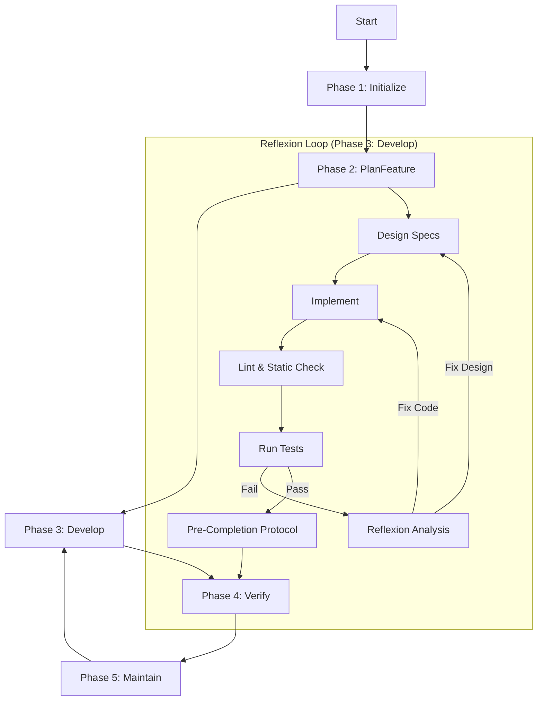

# Complete Workflow

↩️ [返回概览](SKILL.md)

> **Note:** Module numbers (1-8) represent documentation order, NOT execution priority or importance. Phase 3 (Develop/Reflexion Loop) is the core execution engine where most time is spent.

## Process Visualization

## Phase 1: Initialize
**Alias:** Project Initialization (Initializer Agent)

**Goal:** Set up environment, create knowledge base structure, establish basic constraints

**Checklist:**
- [ ] Initialize Git repository
- [ ] **Setup CI/CD Pipeline** (e.g., GitHub Actions)
- [ ] **Configure Linter & Formatter** (Architecture rules enforcement)
- [ ] **Initialize Test Framework**
- [ ] Create `AGENTS.md` (project map)
- [ ] Create `architecture.md` (architecture bird's eye view)
- [ ] Create `docs/` directory structure
- [ ] Create `feature_list.json` (feature inventory)
- [ ] Create `progress.txt` (progress log)
- [ ] Set basic architecture constraints

**See [Module 1: Project Initialization](modules/initialization.md) for file templates.**

## Phase 2: PlanFeature
**Alias:** Feature Planning

**Goal:** Create structured feature inventory, clarify all requirements

**Checklist:**
- [ ] Decompose features into specific end-to-end descriptions
- [ ] **Define Verification Strategy** for each feature
- [ ] All features marked as "not passed" (pass: false)
- [ ] Feature inventory uses JSON format

**See [Module 3: Feature Inventory Management](modules/feature-management.md) for JSON format details.**

## Phase 3: Develop
**Alias:** Incremental Development, Reflexion Loop (Coding Agent)

**Goal:** One feature at a time, maintain Clean State

**See [Module 4: Incremental Development Workflow](modules/development-workflow.md) for:**
- **Context Discovery Phase** (upgrade from Startup Sequence)
- One Feature At A Time Rule
- **Failure Analysis Protocol** (when tests fail)
- **Pre-Completion Protocol** (before finishing)

## Phase 4: Verify
**Alias:** Verification & Merge

**Goal:** Test, review, merge, maintain high throughput

**Observability Checklist (Must Have):**
- [ ] **Logs**: No error logs during test run?
- [ ] **Visuals**: DOM snapshots passed? (or UI screenshots matched?)
- [ ] **Metrics**: Performance within limits?

**See [Module 6: Code Merge Strategy](modules/code-merge.md) for:**
- Fast Feedback Economics
- Three Key Actions (Minimize Blocking Gates, Keep PR Lifecycle Short, Handle Flaky Tests)

## Phase 5: Maintain
**Alias:** Continuous Maintenance

**Goal:** Continuously clean technical debt, maintain architectural coherence

**See [Module 8: Technical Debt Handling](modules/technical-debt.md) for:**
- Golden Principles
- Continuous Cleanup Mechanism
