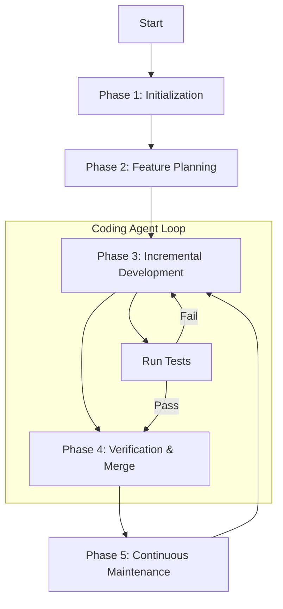

# Complete Workflow

## Process Visualization



## Phase 1: Project Initialization (Initializer Agent)
**Goal:** Set up environment, create knowledge base structure, establish basic constraints

**Checklist:**
- [ ] Initialize Git repository (if not already initialized)
- [ ] Create `.agent.md` (project map)
- [ ] Create `architecture.md` (architecture bird's eye view)
- [ ] Create `docs/` directory structure
- [ ] Create `feature_list.json` (feature inventory)
- [ ] Create `progress.txt` (progress log)
- [ ] Set basic architecture constraints

**Files Created:**
- `.agent.md`
- `architecture.md`
- `feature_list.json`
- `progress.txt`
- `docs/designs/`
- `docs/plans/`
- `docs/principles/`
- `docs/specs/`
- `docs/references/`
- `docs/tech-debt/`
- `docs/quality-scores/`

## Phase 2: Feature Planning
**Goal:** Create structured feature inventory, clarify all requirements

**Checklist:**
- [ ] Decompose features into specific end-to-end descriptions
- [ ] All features marked as "not passed" (pass: false)
- [ ] Feature inventory uses JSON format

**Feature List JSON Format:**
```json
{
  "features": [
    {
      "id": "feature-001",
      "description": "Detailed end-to-end feature description",
      "pass": false,
      "priority": "high",
      "test_type": "e2e"
    }
  ],
  "last_updated": "2026-03-03",
  "clean_state": true
}
```

## Phase 3: Incremental Development (Coding Agent)
**Goal:** One feature at a time, maintain Clean State

**Startup Sequence (MUST execute EVERY session):**
1. **Locate** - Run `pwd` to confirm working directory
2. **Recall** - Read `progress.txt` and Git commit history
3. **Claim Task** - Read `feature_list.json`, find highest priority not yet passed
4. **Restore** - Run tests to verify basic functionality works
5. **Validate** - Confirm system health before starting new development work

**One Feature At A Time Rule:**
- Select one feature from inventory with pass: false
- Complete testing then update feature inventory (pass to true)
- Ensure codebase returns to Clean State
- Commit and log to `progress.txt`

## Phase 4: Verification & Merge
**Goal:** Test, review, merge, maintain high throughput

**Checklist:**
- [ ] Run all tests (unit + e2e)
- [ ] Minimize blocking gates
- [ ] Keep PR lifecycle short
- [ ] Handle flaky tests (re-run instead of blocking)

## Phase 5: Continuous Maintenance
**Goal:** Continuously clean technical debt, maintain architectural coherence

**Golden Principles (Enforce):**
- Prefer shared utility libraries, prohibit handwritten utility functions in different modules
- When handling external data, prohibit "happy path" style random probing
- Must first do explicit structure validation, or use internally encapsulated strongly typed SDK interfaces

**Continuous Cleanup Mechanism:**
- Background regularly runs dedicated agent tasks
- Scans codebase for patterns deviating from golden principles
- Automatically generates targeted refactoring PRs (small scope, quick review)
- Like system-level garbage collection - continuous small-step automatic cleanup

# Checklists

## Project Initialization Checklist
- [ ] Git repository initialized
- [ ] `.agent.md` created
- [ ] `architecture.md` created
- [ ] `docs/` directory structure created
- [ ] `feature_list.json` created (all features pass: false)
- [ ] `progress.txt` created
- [ ] Basic architecture constraints set

## Every Session Startup Checklist
- [ ] Run `pwd` confirm working directory
- [ ] Read `progress.txt`
- [ ] Read `feature_list.json`
- [ ] Check Git last 20 commits
- [ ] Run basic tests verify environment
- [ ] Confirm system health before starting

## Feature Development Checklist
- [ ] Select one feature from inventory
- [ ] Write failing test
- [ ] Implement minimal code
- [ ] Run tests to pass
- [ ] Update feature inventory (pass: true)
- [ ] Ensure Clean State
- [ ] Commit code
- [ ] Update `progress.txt`

## Code Merge Checklist
- [ ] All tests pass
- [ ] PR has short lifecycle
- [ ] Flaky tests handled (re-run not block)

## Continuous Maintenance Checklist
- [ ] Regularly scan codebase for patterns deviating from golden principles
- [ ] Automatically generate refactoring PRs (small scope)
- [ ] Document Gardener has run
- [ ] Knowledge base links validated
